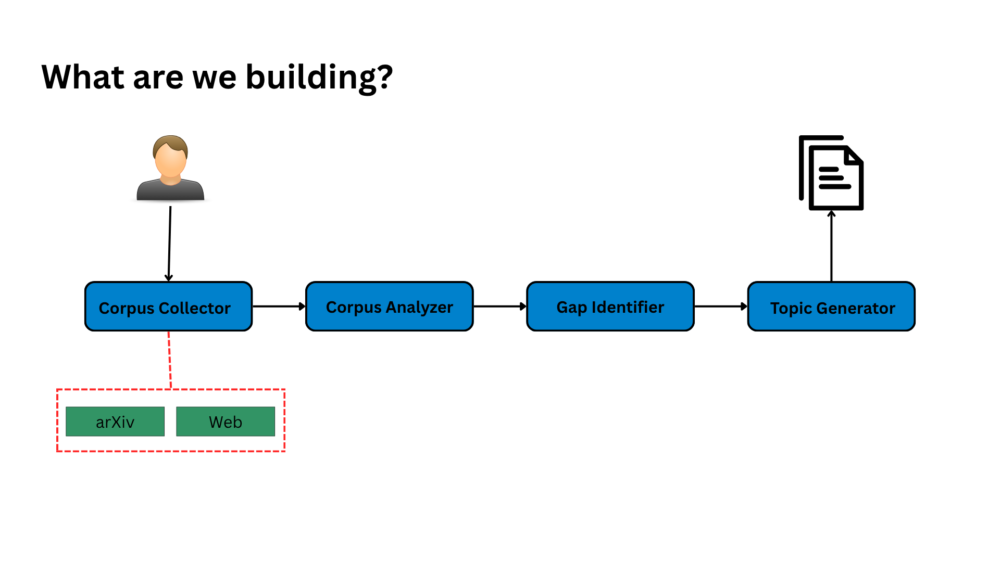

# Quest0

[](https://www.python.org/)  
[](https://streamlit.io/)  
[](https://github.com/mutaverse/Quest0)


Quest0 is an intelligent research topic generator that helps students, researchers,
and academics discover high-quality research topics across all levels—from undergraduate to PhD.
Simply provide an area of research interest, and it will generate relevant topics using
advanced AI LLMs like OpenAI, Mistral, Anthropic, Groq, and more.

Experience a **smooth, chat-based interface** powered by Streamlit,
backed by a multi-agent architecture designed for scalable and precise research topic discovery.

# Why Quest0?

- **Save Time:** No more hours searching for research gaps—Quest0 does it for you.
- **AI-Powered:** Leverages multiple LLM providers to ensure rich, diverse, and accurate topic suggestions.
- **Multi-Level Support:** Generates topics for undergraduate, master's, and PhD research.
- **Transparent Process:** Our backend agents show the research process, from corpus collection to gap identification and topic generation.
- **User-Friendly Interface:** Chat-based UI makes exploring research topics intuitive and interactive.

# Key Features

- **Multi-Agent Backend Architecture:**

  1. **Corpus Collector:** Fetches relevant papers and articles from ArXiv and the web.
  2. **Corpus Analyzer:** Extracts key themes and concepts.
  3. **Research Gap Identifier:** Finds gaps in existing research.
  4. **Research Topic Generator:** Suggests research topics based on analysis.

- **Flexible AI Integration:** Supports OpenAI, Mistral, Anthropic, Groq, and other LLM providers.
- **Streamlit Chat UI:** Sleek frontend for interactive research exploration.
- **Extensible and Scalable:** Easily add new agents or LLM providers as your project grows.

Here’s the flow of the Quest0 agents:

<p align="left">
  
</p>

# Running the App

Follow these simple steps to get the app for Free.

1. **Clone the repository:**

```bash
git clone https://github.com/mutaverse/Quest0.git
cd Quest0
```

2. **Create a virtual environment (Optional):**

```bash
python -m venv venv
source venv/bin/activate  # Windows: venv\Scripts\activate
```

3. **Install dependencies:**

```bash
pip install -r requirements.txt
```

4. **Set up API keys:**
   You can copy `.env.example` file for `.env`. Or use this command to add them.

```bash
export OPENAI_API_KEY="your_api_key"
# Add keys for other providers as needed
```

5. **Run the app:**
   You can copy `.env.example` file for `.env`. Or use this command to add them.

```bash
streamlit run app.py
```

6. **Open in browser** at the URL provided by Streamlit (usually `http://localhost:8501`).

```markdown
> Feel free to modify the app or the agents in any way you want. Experiment with them and see what works best for you.
```

# Contribution

Contributions, suggestions, and feature requests are welcome! Feel free to open an issue or submit a pull request.
